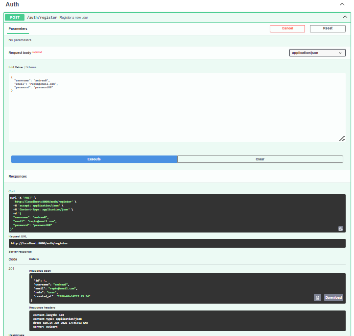
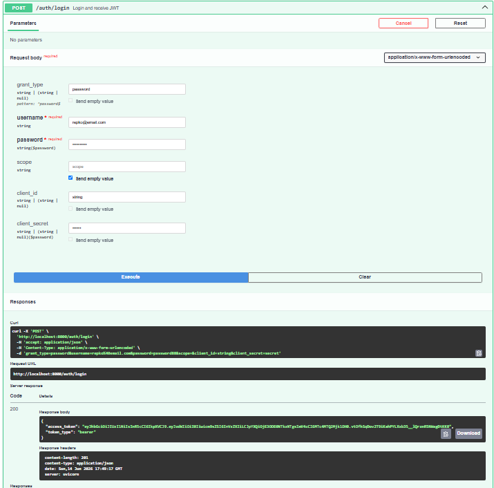
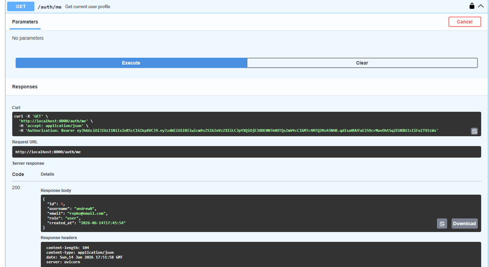
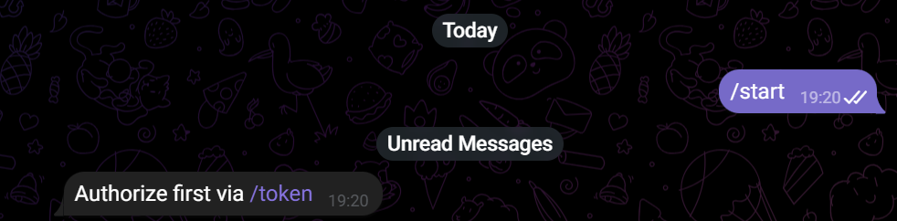
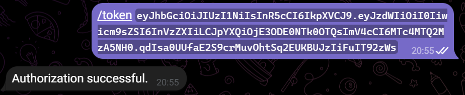
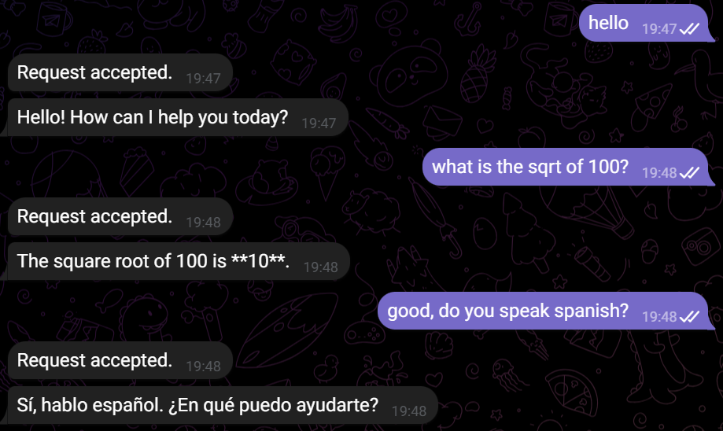
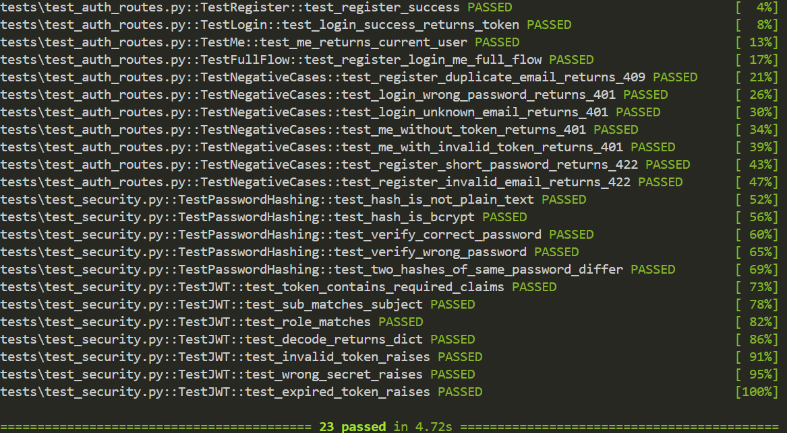
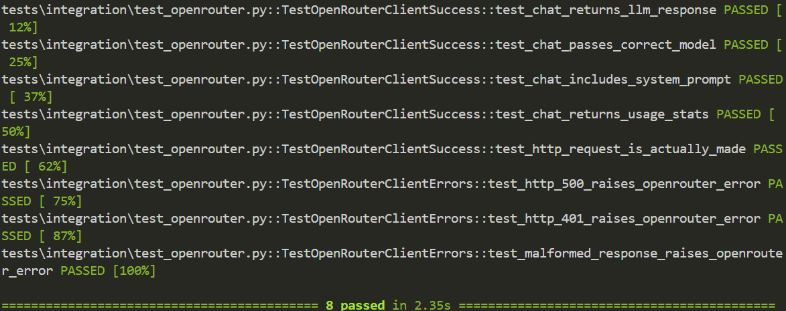

# Двухсервисная система LLM-консультаций

В рамках проекта разрабатывается распределённая система, состоящая из двух логически и технически независимых сервисов, каждый из которых выполняет строго определённую роль. Архитектура построена по принципу разделения ответственности: один сервис отвечает исключительно за аутентификацию и выпуск токенов, второй — за предоставление функциональности LLM-консультаций через Telegram-бота. Такое разделение позволяет изолировать чувствительную логику работы с пользователями и учетными данными от прикладного сервиса, работающего с внешними пользователями и внешними API.

---

## Архитектура

Система состоит из двух независимых сервисов и инфраструктурных компонентов.

```
┌─────────────────────────────────────────────────────────────┐
│                        Пользователь                         │
└───────────────┬─────────────────────────┬───────────────────┘
                │ HTTP (регистрация/логин)│ Telegram
                ▼                         ▼
┌───────────────────────┐     ┌───────────────────────────────┐
│     Auth Service      │     │         Bot Service           │
│     (FastAPI)         │     │  ┌─────────────┐              │
│                       │     │  │  aiogram 3  │ polling      │
│  POST /auth/register  │     │  │  (handlers) │              │
│  POST /auth/login ────┼──JWT┼─▶│             │              │
│  GET  /auth/me        │     │  └──────┬──────┘              │
│                       │     │         │ llm_request.delay() │
│  SQLite (users)       │     │  ┌──────▼──────┐              │
└───────────────────────┘     │  │Celery Worker│              │
                              │  └──────┬──────┘              │
                              │         │ OpenRouter API      │
                              └─────────┼─────────────────────┘
                                        │
                    ┌───────────────────┼───────────────────┐
                    │                   ▼                   │
                    │  ┌────────┐  ┌──────────┐             │
                    │  │ Redis  │  │ RabbitMQ │             │
                    │  │(токены)│  │ (очередь)│             │
                    │  └────────┘  └──────────┘             │
                    │         Инфраструктура                │
                    └───────────────────────────────────────┘
```

---

## Назначение сервисов

### Auth Service

Отвечает исключительно за управление пользователями и выпуск токенов:

- регистрация пользователей (хэширование пароля через bcrypt)
- аутентификация и выпуск JWT (HS256)
- хранение пользователей в SQLite через SQLAlchemy 2.0 async
- предоставление REST API (FastAPI + Swagger UI)

### Bot Service

Отвечает за взаимодействие с пользователем через Telegram и обращение к LLM:

- приём JWT от пользователя и его локальная валидация (без запроса к Auth Service)
- хранение токенов пользователей в Redis
- постановка LLM-запросов в очередь через Celery + RabbitMQ
- обращение к OpenRouter API и отправка ответа пользователю

---

## Структура проекта

```
llm-p/
├── docker-compose.yml
├── auth_service/
│   ├── .env
│   ├── pyproject.toml
|   ├── pytest.ini
│   ├── Dockerfile
│   └── app/
│       ├── api/
|       |   ├── __init__.py
│       │   ├── deps.py         
│       │   ├── router.py     
│       │   └── routes_auth.py 
│       ├── core/
|       |   ├── __init__.py
│       │   ├── config.py        
│       │   ├── exceptions.py    
│       │   └── security.py      
│       ├── db/
|       |   ├── __init__.py
│       │   ├── base.py          
│       │   ├── models.py       
│       │   └── session.py     
│       ├── repositories/
|       |   ├── __init__.py
│       │   └── users.py         
│       ├── schemas/
|       |   ├── __init__.py
│       │   ├── auth.py          
│       │   └── user.py          
│       ├── usecases/
|       |   ├── __init__.py
│       │   └── auth.py           
│       └── main.py              
│
├── bot_service/
│   ├── .env
│   ├── pyproject.toml
|   ├── pytest.ini
│   ├── Dockerfile
│   └── app/
│       ├── bot/
|       |   ├── __init__.py
│       │   ├── handlers.py      
│       │   └── dispatcher.py    
│       ├── core/
|       |   ├── __init__.py
│       │   ├── config.py        
│       │   └── jwt.py           
│       ├── infra/
|       |   ├── __init__.py
│       │   ├── redis.py        
│       │   └── celery_app.py    
│       ├── services/
|       |   ├── __init__.py
│       │   ├── token_storage.py 
│       │   └── openrouter.py    
│       ├── tasks/
|       |   ├── __init__.py
│       │   └── llm_tasks.py     
│       ├── tests/
│       │    └── conftest.py        
│       ├── bot_run.py           
│       └── main.py
```

---

## Сценарий работы

```
1. Пользователь регистрируется через Auth Service API:
   POST /auth/register  {username, email, password}
   ← 201 {id, username, email, role, created_at}

2. Пользователь входит и получает JWT:
   POST /auth/login  {username=email, password}
   ← 200 {access_token, token_type}

   Payload токена:
   {
     "sub": "1",          
     "role": "user",
     "iat": 1718000000,
     "exp": 1718003600    
   }

3. Пользователь открывает Telegram-бота и отправляет:
   /token eyJhbGciOiJIUzI1NiIsInR5cCI6IkpXVCJ9...

   Бот валидирует токен локально (без запроса к Auth Service),
   сохраняет в Redis под ключом tg_token:<telegram_user_id>.

4. Пользователь отправляет вопрос:
   "Что такое asyncio?"

   Бот проверяет наличие токена в Redis → ставит задачу в RabbitMQ
   через llm_request.delay(tg_chat_id, prompt).

5. Celery Worker забирает задачу из очереди:
   - Создаёт OpenRouterClient
   - Отправляет POST https://openrouter.ai/api/v1/chat/completions
   - Получает ответ LLM
   - Отправляет ответ пользователю через bot.send_message()
```

---

## Запуск

### Docker Compose

```bash
# Вставить в bot_service/.env:
# TELEGRAM_BOT_TOKEN=  (получить у @BotFather)
# OPENROUTER_API_KEY=  (получить на openrouter.ai/keys)

docker compose up --build
```

### Локально (Windows)

```bash
# Терминал 1 - Redis и RabbitMQ
docker compose -f docker-compose.yml up redis rabbitmq

# Терминал 2 — Auth Service
cd auth_service
uv run uvicorn app.main:app --reload
# Swagger: http://localhost:8000/docs

# Терминал 3 — Telegram бот
cd bot_service
python -m app.bot_run

# Терминал 4 — Celery worker
# На Windows обязательно --pool=solo
cd bot_service
celery -A app.infra.celery_app.celery_app worker --loglevel=info --pool=solo

```

---

## Тестирование

```bash
# Auth Service
cd auth_service
python -m pytest tests/ -v

# Bot Service
cd bot_service
python -m pytest tests/ -v
```

**Результаты: 45 тестов, 0 ошибок.**

---

## Демонстрация работы

### 1. Auth Service — Swagger UI

#### 1.1 Регистрация пользователя (POST /auth/register)



---

#### 1.2 Логин и получение JWT (POST /auth/login)



---

#### 1.3 Профиль текущего пользователя (GET /auth/me)



---

### 2. Telegram-бот

#### 2.1 Команда /start



---

#### 2.2 Авторизация через /token



---

#### 2.3 LLM-запрос и ответ



---

### 3. RabbitMQ Management UI


---

### 4. Результаты тестирования

#### 4.1 Тесты Auth Service



#### 4.2 Тесты Bot Service


